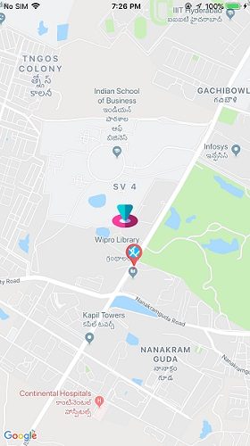

# Working with Google maps
This a sample project on how to work with Google maps, and has some extra features

 

## How to develop
Read the compleget guide here
https://gameofthreads.online/custom-markers-and-latitude-longitude-bounds-on-google-maps-xamarin-forms/

### Using this repo
* You can clone this repo and run the project in Visual Studio
* This project is a subproject to [Xamarin_Samples](https://github.com/dev-aritra/Xamarin_Samples/) repo. So in order to clone this prpject only, go to [Xamarin_Samples](https://github.com/dev-aritra/Xamarin_Samples/) and clone the XF_GoogleMap folder using [GitZip](https://kinolien.github.io/gitzip/). Or you can always clone the whole [Xamarin_Samples](https://github.com/dev-aritra/Xamarin_Samples/) repo.

## Features
1. Custom markers from native images(auto resizable)
2. Latitude Longitude bounds

## Built with 
* [Xamarin Forms](https://docs.microsoft.com/en-us/xamarin/xamarin-forms/)

## Author

* **Aritra Das** - *Blog* - [GameOfThreads](https://gameofthreads.online/)
